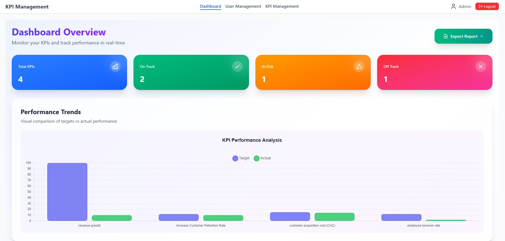
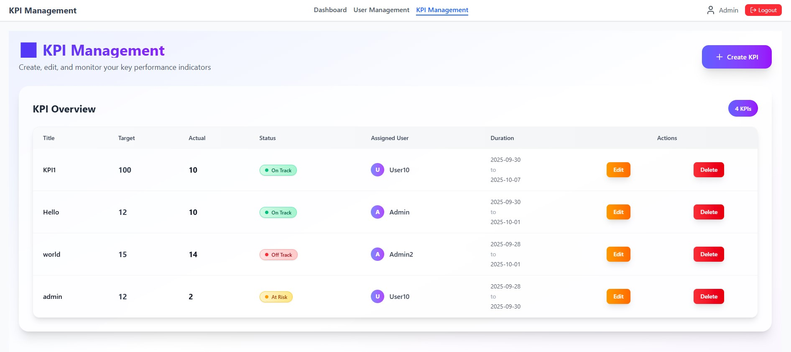
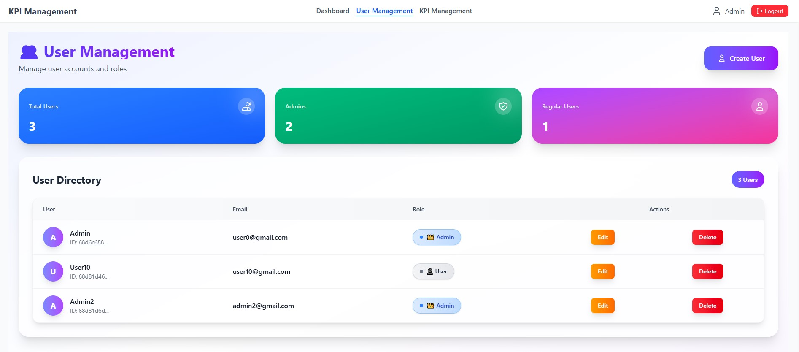

# 📊 KPI Management System

ระบบจัดการ KPI สำหรับผู้ใช้งานทั่วไปและผู้ดูแลระบบ  
สร้างด้วย **MERN Stack (MongoDB, Express.js, React, Node.js)**  
และ **Tailwind CSS** สำหรับ UI  

---

## ✨ Features

- 🔑 ระบบ Authentication (Register / Login ด้วย JWT)  
- 👤 User Management (เฉพาะ Admin เท่านั้น)  
  - ดูรายชื่อผู้ใช้งานทั้งหมด  
  - เพิ่ม / แก้ไข / ลบผู้ใช้งาน  
- 📈 KPI Management  
  - ผู้ใช้ทั่วไปดู / เพิ่ม / แก้ไข / ลบ KPI ของตนเอง  
  - Admin ดูและจัดการ KPI ของผู้ใช้ทุกคนได้  
- 🖥️ Dashboard สรุปข้อมูล KPI ด้วย Chart  
- 🎨 UI ใช้ **Tailwind CSS** → สวยงามและ Responsive  

---

## 🚀 Setup Instructions

### 1. Clone โปรเจค
```bash
git clone https://github.com/phontheppharit/kpi-management-system
cd kpi-management-system
```
### 2. ติดตั้ง dependencies

Backend
```bash
cd backend
npm install
```

Frontend
```bash
cd frontend
npm install
```

### 3. ตั้งค่า Environment Variables

สร้างไฟล์ .env ในโฟลเดอร์ backend แล้วใส่ค่า:
```env
PORT=5000
MONGO_URI=your_mongodb_connection_string
JWT_SECRET=your_secret_key
```
### 4. รันโปรเจค

เปิด terminal 2 อัน:

Backend
```bash
cd backend
npm run dev
```

Frontend
```bash
cd frontend
npm start
```
### 📡 API Documentation
🔑 Authentication
```
POST /api/auth/register → สมัครสมาชิกใหม่
POST /api/auth/login → เข้าสู่ระบบ
```

👤 User Management (สำหรับ Admin)
```
GET /api/users → แสดงรายชื่อผู้ใช้งานทั้งหมด

POST /api/users → สร้างผู้ใช้งานใหม่

PUT /api/users/:id → แก้ไขผู้ใช้งาน

DELETE /api/users/:id → ลบผู้ใช้งาน
```

📈 KPI Management
```
GET /api/kpis/my → ดู KPI ของตัวเอง

POST /api/kpis → เพิ่ม KPI ใหม่

PUT /api/kpis/:id → แก้ไข KPI

DELETE /api/kpis/:id → ลบ KPI
```
### 🖼️ Demo Screenshots
Dashboard
   
KPI Management

My KPI

User Management


### 📂 Project Structure
```plaintext
kpi-management-system/
│
├── backend/              # API และ Database (Node.js + Express + MongoDB)
│   ├── models/           # Mongoose Schemas
│   ├── routes/           # API Routes
│   ├── controllers/      # Logic ของแต่ละ Route
│   ├── middleware/       # JWT Auth Middleware
│   └── server.js         # Entry point
│
├── frontend/             # React + Tailwind CSS
│   ├── src/
│   │   ├── components/   # UI Components
│   │   ├── pages/        # หน้า Dashboard, KPI, User Management
│   │   └── App.jsx
│   └── package.json
│
├── docs/
│   └── screenshots/      # Screenshots สำหรับ README
│
└── README.md             # เอกสารโปรเจค
```
### 👨‍💻 Authors

Phonthep